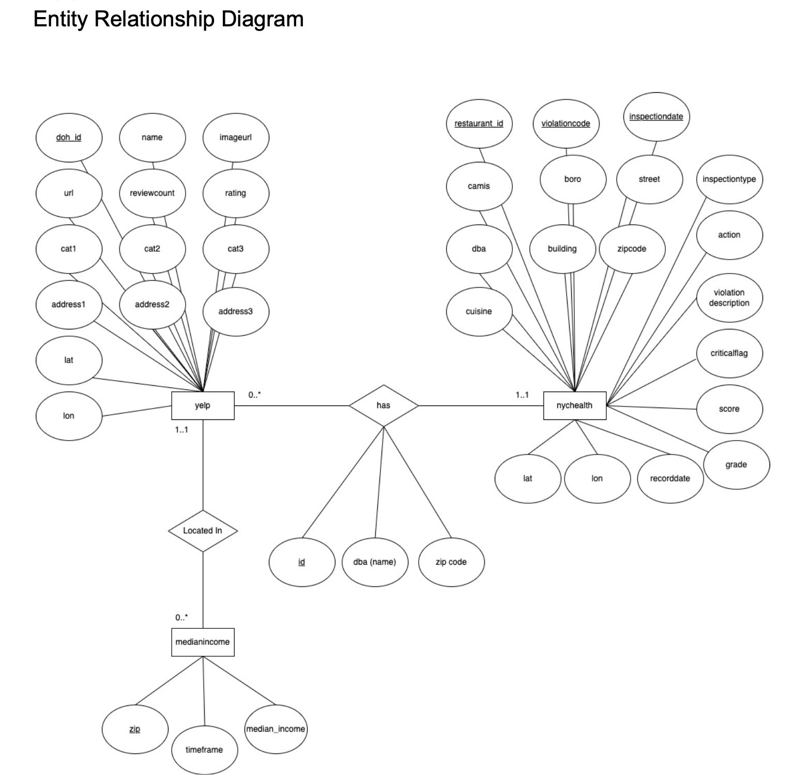

# NY-restaurant-review

Our project aims to better inform residents and tourists in New York about restaurants in the area. We believe that cleanliness is an important factor in deciding whether to eat at a restaurant, in addition to food quality, but a restaurant's health inspection history is not readily available to the average user. With thousands of restaurants in New York, it can be difficult and tedious to look up the health inspection history of each one, especially when trying to decide on where to eat. We wanted to provide a way for users to quickly check the cleanliness of a restaurant they were interested in visiting.
Our application contains a database of over 30,000 restaurants in New York city (one of the most restaurant-dense states in America), and combines it with publicly available health inspection data published by the New York City Department of Health and Mental Hygiene. It also provides information about the median income of the neighborhood, to show any correlations between frequency of health infractions and income levels.

## Architecture:

Technologies Used:
* HTML with EJS
* EJS-Mate
* Node.js
* Express
* MySQL on AWS RDS
* Nodemon
* Redis for caching
* Font-Awesome

The backend runs in Node.js with an Express server, and is set up using an MVC architecture. Though this app could have been fit inside a single file, we decided to set up a more scalable structure of a router that handles incoming requests, a controller that executes the business logic to fulfill the requests (including running the queries), and views which renders HTML based on what the controller returns. This structure adds layers of abstraction that would be necessary should development continue on our app and it grows in size/complexity.

We used MySQL for our database and hosted it on AWS. We chose to use MySQL given the clear relational structure of our data, as there were clear foreign keys which could connect our data, as well as data that was complete and tabular.

## Datasets:
### DOHMH NYC Restaurant Health Inspection Dataset
The NYC Department of Health and Mental Hygiene contains a database that shows historical health inspection violations of all restaurants in the city. This includes inspections of up to 8 years prior from the most recent violation recorded. The dataset contains useful information such as restaurant ID and DBA, location, cuisine, date of inspection, violation code & description, and severity of the violation.

### Yelp Restaurant Dataset
The Yelp dataset is accessed via an API and it contains review data of each restaurant in NYC from Yelp. Additional to review data, it contains location and contact information, images, ratings, and food categories.

### NYC Median Income Dataset
The NY Median Income dataset contains data on the median household income for all households in New York by zip code from years 2017-2019. This data will be used to join median household income to the zip codes in the NYC Restaurant Health Inspection dataset. With this we can identify some key demographic trends such as the correlation of median household income and the number of violations committed by restaurants in the area.

### Entity Relationship Diagram
<p align="center">
  <kbd>
    
  </kbd>
</p>

## Queries:
### Query 1: `/restaurants`
This query relates to the /restaurants route, which displays a list of relevant attributes (name, location, number of health infractions. The list is ordered alphabetically by default.
```sql
WITH DistinctRestaurants AS (
    SELECT DISTINCT doh_id, name, boro, COUNT(camis) as num_violations
    FROM yelp
             JOIN nychealth ON nychealth.restaurant_id = yelp.doh_id
    GROUP BY nychealth.restaurant_id, yelp.name
    ORDER BY yelp.name
)
SELECT name, boro, num_violations
FROM DistinctRestaurants;
```

### Query 2: `/infractions`
This query relates to the /infractions route, which displays a list of different violations given by health inspectors. The query also aggregates the number of restaurants that have been given this violation. The list is ordered by most common violations to least.
```sql
SELECT DISTINCT violationcode, violationdescription, criticalflag,
COUNT(violationcode) as num_violations_in_NY
FROM nychealth
GROUP BY violationcode
ORDER BY num_violations_in_NY DESC;
```

### Query 3: `/infractions/:id`
This query relates to the /infractions/:id route, which displays a detailed list of restaurants that have been charged with a specific violation code. The list is ordered by the most recent inspection date.
```sql
SELECT violationcode, name, url, inspectiondate, address1, address2, city,
zip
    FROM yelp JOIN nychealth ON nychealth.restaurant_id = yelp.doh_id
    WHERE violationcode="${req.params.id}"
    ORDER BY inspectiondate;
```

### Query 4: `/zips`
This query relates to the /zips route, which displays information by zip code in New York, including number of restaurants, median income, and number of historical health violations.
```sql
WITH Restaurant_zip_2019 AS (
        SELECT medianincome.zip, medianincome.median_income,
COUNT(yelp.doh_id) as num_restaurants
        FROM medianincome
        JOIN yelp on medianincome.zip = yelp.zip
        WHERE medianincome.timeframe='2019'
        GROUP BY medianincome.zip
    ), Violations_zip_2019 AS (
        SELECT medianincome.zip, COUNT(nychealth.camis) as
num_historical_violations
        FROM medianincome
        JOIN nychealth on medianincome.zip = nychealth.zipcode
        WHERE medianincome.timeframe='2019'
        GROUP BY medianincome.zip
        SELECT Restaurant_zip_2019.zip, median_income, num_restaurants,
num_historical_violations
    FROM Restaurant_zip_2019 JOIN Violations_zip_2019 ON
Restaurant_zip_2019.zip=Violations_zip_2019.zip
    ORDER BY num_restaurants DESC;
)
```

### Query 5: `/zip/:id`
This query relates to the /zips route, which displays information about a specific zip code in New York, including the top 10 most common health violations by type. The list is ordered by most common health violations.
```sql
 SELECT zipcode, violationcode, violationdescription, COUNT(nychealth.camis)
as num_violation
    FROM nychealth
    WHERE zipcode="${req.params.id}"
    GROUP BY zipcode, violationcode
    ORDER BY num_violation DESC
    LIMIT 10;
```

## Setup guide:

1. Clone this repo
2. Run `npm install` to install all project dependencies
3. Run `nodemon app.js` to start the server
4. Navigate to `http://localhost:8080/`
